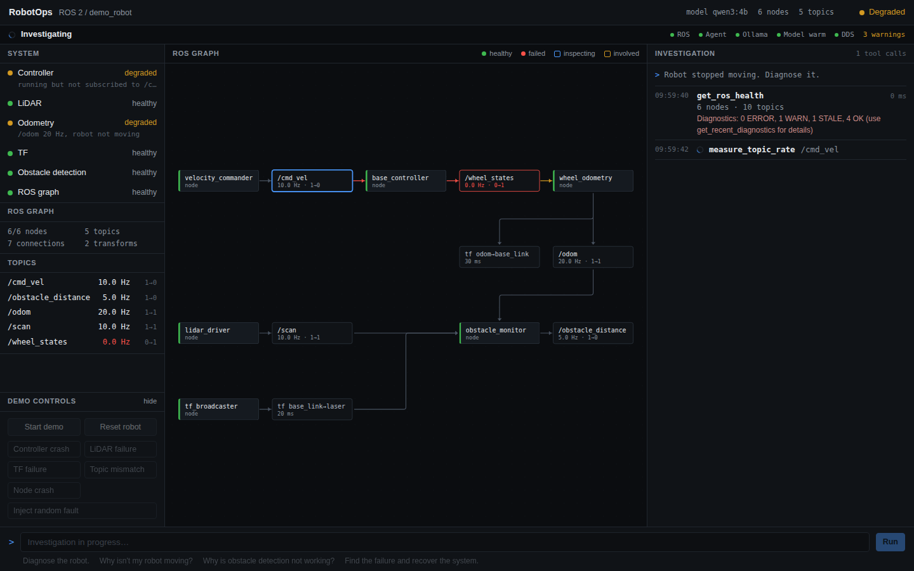
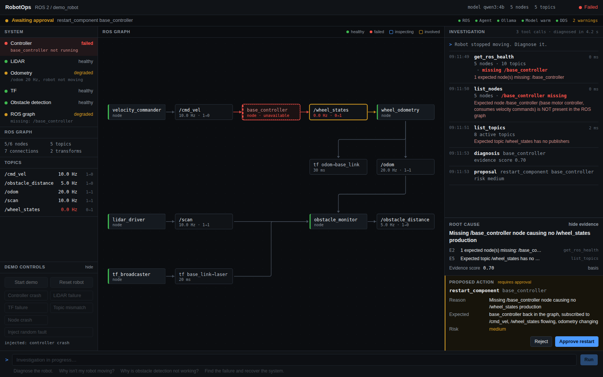
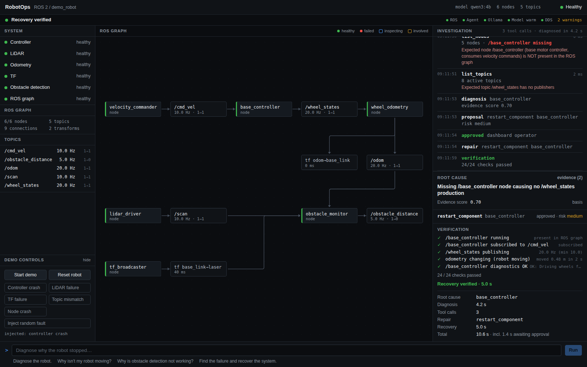
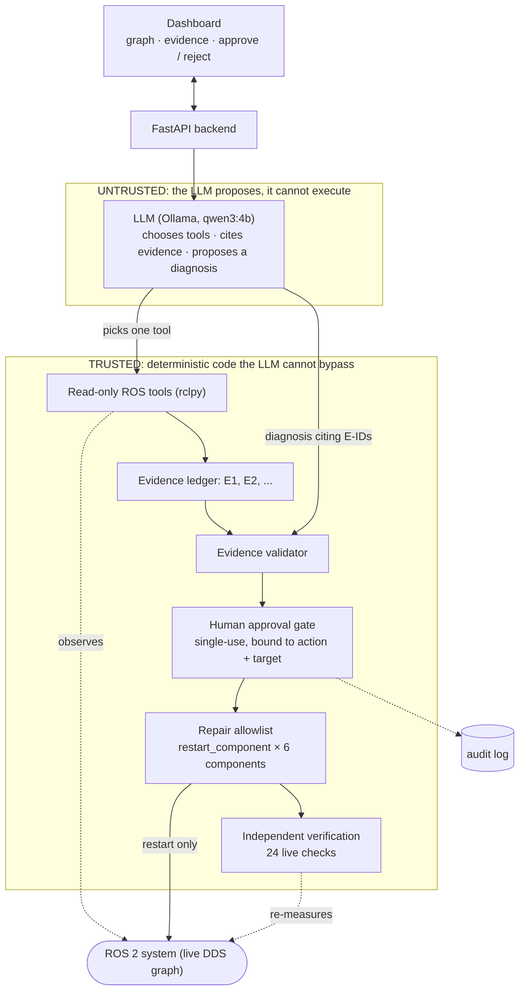

# RobotOps

**AI reliability engineer for ROS 2 robots.**

RobotOps investigates failures in a live ROS 2 system, gathers evidence, identifies a likely root cause, proposes a guarded repair, and independently verifies recovery.


<sub>A real run of the dashboard, not a mock-up: the controller node crashes, RobotOps investigates, a human approves the restart, and 24 independent checks confirm recovery.
The clip is one uncut run (31 s; 6 fps GIF, [full-quality MP4](docs/media/hero-demo.mp4)), recorded by the UI test harness driving the real dashboard with short reading pauses. See [Reproduce the demo](#reproduce-the-demo).</sub>

```text
Robot stops  →  RobotOps investigates ROS  →  Controller failure identified  →  Evidence validated
             →  Repair approved  →  Controller restarted  →  24/24 recovery checks pass
```

[Problem statement](#problem-statement) · [Solution](#solution) · [What it does](#what-robotops-does) · [Why AI?](#why-ai) · [Architecture](#architecture) · [Safety](#safety-model) · [Results](#results) · [Quick start](#quick-start) · [Limitations](#limitations)

| | |
|---|---|
| **Team** | Bluey |
| **Member** | Adarsh D |
| **Hackathon** | CypherAI |
| **Status** | Feature-complete demo, feature-frozen. CI runs the fast tests and the dashboard build ([`.github/workflows/ci.yml`](.github/workflows/ci.yml)). |

Reviewing this repository? The [submission audit](docs/SUBMISSION_AUDIT.md) answers the usual questions (problem, where AI is used, safety, evidence, how to run) with links.

## Problem statement

**Diagnosing a failed ROS 2 robot is slow, manual and expert-only, and the repair is only trusted once someone has checked that the robot really recovered.**

When a ROS 2 robot stops working, an engineer starts a manual investigation across a distributed system:

`ros2 node list` (is every node up?) → `ros2 topic list` / `ros2 topic info /cmd_vel` (does anything subscribe?) → `ros2 topic hz /wheel_states` (is data flowing?) → TF (is the `base_link → laser` transform fresh?) → `/diagnostics` and node logs (what did each component report?) → the controller's state (did it crash, and why?).

Each step depends on what the last one showed, the symptoms are far from the cause (a dead controller shows up as "the robot doesn't move" and "odometry is frozen"), and it is repeated for every incident.

## Solution

**RobotOps is an AI reliability engineer that runs that investigation for you, on the live system, and keeps a human in control of the fix.**
A local LLM decides which read-only ROS check to run next; code turns every result into numbered evidence and rejects any diagnosis that is not backed by it;
a person approves the one allowlisted repair (`restart_component`); and RobotOps then re-measures the whole robot (24 checks) before it reports recovery.
In the demo, a crashed controller is found, explained with cited evidence, restarted and verified in about 16 s from the question to recovery (median of 10 runs).

### At a glance

| | |
|---|---|
| **Input** | a live ROS 2 graph (nodes, topics, rates, TF, diagnostics, logs) and a question such as *"Robot stopped moving. Diagnose it."* |
| **AI's job** | choose the next read-only check, form a hypothesis, write a diagnosis that cites evidence IDs (local `qwen3:4b`, no cloud, no API key) |
| **Code's job** | run the checks, number the evidence, validate every citation, gate the repair behind human approval, execute only allowlisted repairs, verify recovery |
| **Output** | root cause with cited evidence, a guarded repair proposal, and a verified recovery report (24 independent checks) |
| **Proof** | real recording above · hero 10/10 · random hidden fault 15/15 on the five-fault set · 143 fast + 19 live-ROS tests · raw data in [`benchmarks/`](benchmarks) |
| **Run it** | `./scripts/setup.sh` → `./run_demo.sh` → <http://127.0.0.1:8000> ([Quick start](#quick-start)) |

## What RobotOps does

```text
Observe → Investigate → Gather evidence → Diagnose → Propose repair → Human approval → Repair → Verify
```

1. **Observe**: a read-only health snapshot of the live ROS graph (nodes, topics, rates, TF, diagnostics).
2. **Investigate**: a local LLM chooses the next read-only ROS tool to run, one at a time, based on what it has seen so far.
3. **Gather evidence**: every tool result becomes numbered, timestamped evidence (`E1`, `E2`, ...) whose findings are generated by code from the measurement.
4. **Diagnose**: the LLM names a root cause and *cites evidence IDs*. Code validates the citations before anything else happens.
5. **Propose repair**: the proposal (action, target, reason, expected result, risk) is shown to a human.
6. **Human approval**: nothing that changes the robot runs without an explicit, single-use approval bound to that exact action and target.
7. **Repair**: an allowlisted `restart_component`.
8. **Verify**: 24 independent live checks re-measure the *whole* robot. A zero exit code counts for nothing.

## Demo

Real trace of the controller-failure scenario (query: *"Robot stopped moving. Diagnose it."*). The complete machine-readable record of this run,
including the full event stream and all 24 verification checks, is [`docs/examples/controller_failure_trace.json`](docs/examples/controller_failure_trace.json).

| Time | Event | What RobotOps saw or did |
|---|---|---|
| +0.0 s | observe | `get_ros_health` → *E2 [ANOMALY] 1 expected node(s) missing: /base_controller* |
| +1.2 s | LLM picks `list_nodes` | *E4 [ANOMALY] Expected node /base_controller (base motor controller, consumes velocity commands) is NOT present in the ROS graph* |
| +2.2 s | LLM picks `list_topics` | *E5 [ANOMALY] Expected topic /wheel_states has no publishers* |
| +4.1 s | LLM submits diagnosis, citing `E2`, `E5` | validator: IDs exist, 2 distinct tool calls, anomalies concern the target, action allowlisted → **accepted** |
| +4.1 s | proposal | `restart_component base_controller`, risk *medium*, **awaiting approval** |
| operator clicks Approve | approval | single-use approval bound to `restart_component / base_controller` |
| approval + 0.04 s | repair | the supervisor restarts the process |
| approval + 5.1 s | verification | **24 / 24 checks passed**: `/base_controller` in the graph, subscribed to `/cmd_vel`, `/wheel_states` at 20 Hz, odometry changing, controller diagnostics OK, ... |

<table>
<tr>
<td width="33%"><a href="docs/screenshots/states/03_investigating.png"></a><sub><b>Investigating.</b> The model chooses one read-only tool at a time; the graph highlights what is being inspected and each result is shown with its real values.</sub></td>
<td width="33%"><a href="docs/screenshots/hero/03_approval.png"></a><sub><b>Awaiting approval.</b> The root cause cites evidence <code>E2</code> and <code>E5</code>; the proposed <code>restart_component base_controller</code> executes only after a human clicks Approve.</sub></td>
<td width="33%"><a href="docs/screenshots/hero/04_resolved.png"></a><sub><b>Recovery verified.</b> The whole robot was re-measured after the restart: 24 of 24 checks passed, and the summary shows the measured diagnosis and recovery times.</sub></td>
</tr>
</table>

## Why AI?

Diagnosing a distributed robot is a *sequential decision problem*: which check is worth running next depends on what the previous one revealed, and the symptom
("the robot doesn't move") is not the cause. RobotOps splits the work along that line.

| The LLM does (judgement) | Deterministic code does (facts and guarantees) |
|---|---|
| chooses which diagnostic tool to run next | executes the ROS observations (rclpy) |
| decides what to inspect next given the evidence so far | turns measurements into findings and numbers the evidence (`E1`, `E2`, ...) |
| forms a hypothesis about the root cause | validates that every evidence reference exists, comes from real tool output, and supports the claim |
| synthesizes the diagnosis and recommends an action | enforces permissions and the human-approval gate |
| | executes only allowlisted repairs |
| | verifies recovery independently |

**It is not `if fault == X: restart X`.** There is no fault-to-tool or fault-to-repair table, and the fault's identity never reaches the agent: the supervisor
keeps it for scoring only, the API withholds it for random faults, and a test plus a prompt audit (`ROBOTOPS_AUDIT_PROMPTS=1`) check that no fault identifier appears in any recorded model input.
The tool sequence really depends on the evidence: for the same query the model chose `list_nodes → list_topics` for a controller crash, `get_recent_diagnostics → check_tf` for a TF failure,
and `get_recent_diagnostics → check_tf → measure_topic_rate` for a LiDAR failure ([benchmark table](benchmarks/results_20260920_052452.md)).
Honest caveat: with a fixed sampling seed the same fault gives the same sequence, and the small model has habits (see [Limitations](#limitations)).

## Architecture



**Trust boundaries.** The LLM can only (1) choose one of the *read-only* tools and (2) submit a diagnosis that cites evidence IDs. It has no execution tool, no shell and no
way to write to the audit log. A diagnosis reaches a human only through the **evidence validator**; a repair runs only through the **approval gate**
and the **allowlist**; a run only counts as recovered through **independent verification**. Each of those is ordinary code, unit-tested, and sits
outside the model. Implementation: [`backend/agent/`](backend/agent) (state machine, validator, verifier), [`backend/ros_tools/`](backend/ros_tools) (tools, repair), [`backend/safety/`](backend/safety) (policy, approvals, audit).
Design notes: [docs/DESIGN.md](docs/DESIGN.md).

## Evidence-grounded diagnosis

Every observation becomes an entry in an **evidence ledger** with an ID, produced by code. The LLM never writes evidence; it can only *refer* to it.
A diagnosis is admissible only if code can check it against the ledger. This is the real accepted diagnosis from the run above
(trimmed; full record in [`docs/examples/controller_failure_trace.json`](docs/examples/controller_failure_trace.json)):

```json
{
  "status": "diagnosed",
  "faulty_component": "base_controller",
  "root_cause": "Missing /base_controller node causing no /wheel_states production",
  "evidence": [
    { "id": "E2", "source": "get_ros_health", "step": 1, "anomaly": true, "text": "1 expected node(s) missing: /base_controller" },
    { "id": "E5", "source": "list_topics",    "step": 3, "anomaly": true, "text": "Expected topic /wheel_states has no publishers" }
  ],
  "confidence": 0.7,
  "confidence_basis": ["base 0.30", "+0.30: 2 anomaly finding(s) about the faulty component", "+0.10: corroborated by 2 independent tools"],
  "recommended_action": { "action": "restart_component", "target": "base_controller", "risk": "medium", "requires_approval": true }
}
```

The validator rejects a diagnosis (and tells the model why) when: a cited ID does not exist; the cited findings come from fewer than two different tool calls;
none of them is an anomaly about the named component; or the action is not allowlisted. Repeated rejection ends the investigation as **inconclusive** and no repair is proposed.
`confidence` is a labelled *evidence score* computed in code from the number and diversity of cited anomalies, not the model's own confidence.
The UI and logs show tool calls, values, evidence and one-line summaries only; the model's private reasoning is never stored or displayed.

## Safety model

- **Read-only tools run automatically.** The LLM's tool list contains 11 read-only ROS tools and nothing that changes state (tested).
- **State-changing actions require approval.** A repair needs a proposal that passed the evidence gate and a human approval that is single-use, expires, and is bound to `(action, target)`; replay and action-swapping are refused (tested).
- **Only allowlisted repairs execute.** One primitive, `restart_component`, on six named demo components. Anything else raises `PolicyViolation`.
- **Independent verification.** The state machine cannot go from `REPAIRING` to `RESOLVED`; only 24 live re-measurements of the whole robot can. If they fail: one more investigation round, then *repair failed* and a safe stop.
- **No arbitrary shell.** Model-supplied arguments are pattern-validated and clamped; there is no `shell=True` anywhere and the model has no execution tool.
- **Audited and bounded.** `logs/audit.jsonl` records decisions, tool calls, approvals, repairs and verification. Step, turn, rejection and round caps and a 60 s model timeout (one retry, then a safe stop) bound every investigation.
- **Graceful degradation.** ROS down, Ollama down, model timeout, malformed model output, unknown node or topic, unreachable supervisor: each yields a structured error and a safe stop, not a crash.

## Fault scenarios

| Fault | Observable symptom | Repair |
|---|---|---|
| Controller crash | `base_controller` exits (FATAL log, exit code 1): `/cmd_vel` has no subscriber, `/wheel_states` disappears, odometry freezes | `restart_component base_controller` |
| LiDAR failure | `lidar_driver` stays alive but stops publishing: `/scan` at 0 Hz, LiDAR diagnostics ERROR, obstacle detection degraded | `restart_component lidar_driver` |
| TF failure | `tf_broadcaster` hangs: `base_link → laser` transform goes stale while `/scan` still runs at 10 Hz | `restart_component tf_broadcaster` |
| Topic mismatch | `base_controller` relaunched listening on `/cmd_vel_nav`: node alive, `/cmd_vel` has 0 subscribers, `/cmd_vel_nav` has 0 publishers | `restart_component base_controller` |
| Node crash | `obstacle_monitor` exits: node missing, `/scan` lost its subscriber, `/obstacle_distance` gone | `restart_component obstacle_monitor` |
| **Random failure** | one of the above, chosen by the supervisor; its identity is **hidden from the agent** and not returned by the API | whichever the evidence supports |

The repair column describes what the *correct* outcome is; the agent is never told it. Faults are injected into a real, running rclpy demo robot (6 nodes, real DDS traffic), not simulated in the UI.

## Results

Everything below was measured on the demo robot in this repository, on one laptop (RTX 4050 6 GB, WSL2), with `qwen3:4b`. Raw data is in [`benchmarks/`](benchmarks); methodology and caveats follow the tables.

| Measurement | Result | Source |
|---|---|---|
| Hero scenario (controller crash), real dashboard, consecutive runs | **10/10** diagnosed, repaired and verified | [`benchmarks/hero/hero_acceptance_20260920_0636.json`](benchmarks/hero/hero_acceptance_20260920_0636.json) |
| Random fault (fault identity hidden), real dashboard | **15/15** diagnosed, repaired and verified on the five-fault acceptance set (all five faults occurred) | [`benchmarks/random/random_20260920_0454.json`](benchmarks/random/random_20260920_0454.json) |
| Recovery checks per successful repair | **24/24** in every one of those runs | same files |
| Model timeouts in the acceptance runs | **0** | same files |
| Hero diagnosis time (query → accepted diagnosis) | **10.6 s median** (7.5–11.3 s) | hero acceptance file |
| Hero query → recovery verified | 16.4 s median (max 17.1 s); approval → verified 5.4 s median | hero acceptance file |
| Clean-state benchmark, generic query *"Diagnose the robot."*, 5 faults × 3 | 15/15 correct, repaired, verified; diagnosis median 4.7 s, p95 9.1 s (n = 15) | [`benchmarks/results_20260920_052452.md`](benchmarks/results_20260920_052452.md) |
| Automated tests | 143 fast tests (124 behaviour, 19 documentation checks) + 19 live-ROS tests, all passing | `pytest tests` |

<details>
<summary>Per-fault detail of the 15-run benchmark (3 runs per fault, generic query, real model choices)</summary>

| Fault | Diagnosed component (3/3 correct) | Tools the model chose after the baseline | Diagnosis time |
|---|---|---|---|
| Controller crash | `base_controller` | `list_nodes → list_topics` | 4.4–4.5 s |
| LiDAR failure | `lidar_driver` | `get_recent_diagnostics → check_tf → measure_topic_rate` | 8.6–9.1 s |
| TF failure | `tf_broadcaster` | `get_recent_diagnostics → check_tf` | 4.7–4.9 s |
| Topic mismatch | `base_controller` | `get_recent_diagnostics → inspect_node` (first run also `list_topics → list_nodes`) | 4.3–7.0 s |
| Node crash | `obstacle_monitor` | `list_nodes → list_topics` | 4.5–5.0 s |

All 15 runs were repaired (auto-approved in benchmark mode) and verified 24/24. Full per-run table: [`benchmarks/results_20260920_052452.md`](benchmarks/results_20260920_052452.md).
</details>

**Methodology.** *Hero* runs drive the real dashboard with real clicks (Start demo → inject Controller Failure → ask *"Robot stopped moving. Diagnose it."* → approve) and read the outcome from the UI and API.
*Random* runs inject a hidden random fault and ask the generic query; correctness is scored against the supervisor's ground truth, which the agent never sees.
The *benchmark* runner (`benchmarks/run_benchmark.py`) resets the robot, verifies a healthy baseline, injects each fault, asks the same generic query, scores the diagnosis against the injected fault, auto-approves the repair (benchmark mode, logged) and verifies recovery.
A run counts as *correct* only if the named component matches the injected fault. Each run writes a new timestamped file; earlier files, including the failed early ones, are kept.

**How to read these numbers.**
- The sample is small (10–15 runs per measurement, one machine, one model). "15/15 on the five-fault acceptance set" is what was measured; it is evidence of reliability *on this setup*, not a claim of general accuracy.
- The 15-run benchmark ran while an unrelated CPU/GPU-heavy job was using the machine (the runner's machine check recorded it), so its latencies are if anything pessimistic. The generic query leads the model to a shorter route than the hero query, which is why its median is lower than the hero's.
- Earlier versions did worse and the files are kept: the first agent needed a median of 129.9 s per diagnosis on a shared machine, and `llama3.2:3b` completed no investigation ([`benchmarks/results.md`](benchmarks/results.md), [`benchmarks/results_llama.md`](benchmarks/results_llama.md)).
- The fault set is the five injected failure modes of this demo robot. Nothing here measures performance on real hardware or on failures outside that set.

## Performance

The first working version took a **~92 s** warm median per diagnosis. Profiling ([docs/PERFORMANCE.md](docs/PERFORMANCE.md), profiles in [`benchmarks/profiles/`](benchmarks/profiles)) showed the cause was not ROS or the GPU: the model generated about 3,000 tokens of unnecessary prose per diagnosis.
Fixes: grammar-constrained JSON decisions (no room for prose), a compact context (a manifest summary instead of raw dumps), a GPU-resident model with a blocking warm-up gate before the demo is declared ready, and a bounded per-request timeout with a retry.
Result: the hero diagnosis takes **10.6 s median** through the real dashboard (3–6 model calls of ~1–2 s each).

## UI

The dashboard is an engineering console: **System** health and topic rates on the left, the live **ROS graph** in the centre (failed, inspected and involved nodes are marked), and the **Investigation** event stream on the right, followed by the root cause with its evidence, the proposed action with **Approve / Reject**, and the verification result. The status bar always states what is happening (Ready, Fault detected, Investigating, Awaiting approval, Verifying recovery, Recovery verified) and shows ROS / Agent / Ollama / Model / DDS readiness.

## Quick start

Requirements (details and troubleshooting in [docs/SETUP.md](docs/SETUP.md)): Linux or WSL2 with **ROS 2 Lyrical** (rclpy, Cyclone DDS), Python 3.14 as used by that ROS install, Node.js 20+, and [Ollama](https://ollama.com) with the `qwen3:4b` model (`ollama pull qwen3:4b`). No API keys, no cloud service, no Docker.

```bash
git clone https://github.com/Greninja44/robotops.git
cd robotops
./scripts/setup.sh          # one-time: checks prerequisites, creates .venv, installs Python + frontend dependencies
./run_demo.sh               # starts Ollama, warms the model, starts the demo robot + backend + dashboard, runs the preflight
./demo_preflight.sh         # prints "ROBOTOPS DEMO READY"
```

Then open **http://127.0.0.1:8000**. Stop everything with `./scripts/stop_all.sh`. Something not ready? `./demo_preflight.sh` names the failing check; [docs/SETUP.md](docs/SETUP.md#troubleshooting) has the fixes.

## Reproduce the demo

1. `./run_demo.sh` (wait for `ROBOTOPS DEMO READY`)
2. Open <http://127.0.0.1:8000>
3. Press **Start demo** under *Demo controls* (resets the robot and waits until the model is warm)
4. Inject **Controller crash**
5. Enter `Robot stopped moving. Diagnose it.` and press **Run**
6. Inspect the evidence behind the root cause
7. Press **Approve restart**
8. Observe **Recovery verified** (24 / 24 checks)

Try **Inject random fault** with the query `Diagnose the robot.` to see the agent find a fault it was never told about.
The same sequence, scripted: `.venv/bin/python scripts/ui_hero_demo.py --runs 1`; to record it, `--video docs/media/hero-demo.webm` ([docs/RECORDING.md](docs/RECORDING.md)).

## Testing

The fast suite and the dashboard build also run in CI on every push and pull request ([`.github/workflows/ci.yml`](.github/workflows/ci.yml)); the live-ROS tests and benchmarks need ROS 2 and Ollama, so they run locally.

```bash
.venv/bin/python -m pytest tests -m "not ros"       # 143 fast tests (~10 s): validator, state machine, safety policy, approvals, no-fault-leak, timeouts, API, docs links
./scripts/start_demo.sh
.venv/bin/python -m pytest tests -m ros             # 19 live tests against the running ROS 2 demo robot (~4 min)
./scripts/verify_demo.sh --full                     # end-to-end: services, ROS health, tools, fault injection, full diagnose → repair → verify loop
.venv/bin/python benchmarks/run_benchmark.py --repeat 3      # the benchmark (writes a new timestamped file in benchmarks/)
.venv/bin/python scripts/ui_random_demo.py --runs 15         # random-fault batch through the real dashboard
(cd frontend && npx tsc -b && npm run lint && npm run build)
```

## Technical stack

ROS 2 **Lyrical** (`rclpy`, `tf2_ros`, Cyclone DDS) · Python 3.14 · FastAPI + WebSocket + `httpx` + `pydantic` · Ollama with **`qwen3:4b`** (grammar-constrained JSON decisions, local inference) ·
React 19 + TypeScript + Vite + React Flow (`@xyflow/react`) · `pytest` (+ Playwright for the UI harnesses). No LangGraph: the agent is a small explicit state machine ([`backend/agent/graph.py`](backend/agent/graph.py)).

## Repository structure

```text
backend/
  agent/        state machine, LLM client, prompts, evidence ledger, diagnosis validator, verifier
  ros_tools/    11 read-only rclpy tools, allowlisted repair executor, supervisor client
  safety/       policy (allowlist, evidence gate), approvals, audit log
  main.py, monitor.py, readiness.py   FastAPI app, live health/graph monitor, preflight logic
frontend/       React dashboard (src/components, src/lib)
demo_robot/     6 rclpy nodes, process supervisor with fault injection, manifest.json (healthy reference)
benchmarks/     runner + measured results (hero/, random/, profiles/) - never hand-written
tests/          fast unit/API tests and live-ROS tests (pytest marker: ros)
scripts/        setup, start/stop/verify, UI harnesses (screenshots, recordings, reliability runs), profiling
config/         Cyclone DDS settings for WSL2
docs/           SETUP, DESIGN, PERFORMANCE, RECORDING, SUBMISSION_AUDIT, GITHUB_SUBMISSION, screenshots/, media/, examples/
run_demo.sh, demo_preflight.sh
```

## Limitations

- **Demo topology.** The robot is a lightweight rclpy simulation of failure modes (6 nodes, real DDS), not hardware, Gazebo or Nav2. The tool layer is generic (graph, topic, TF, parameter, diagnostics, log inspection), but the healthy-reference manifest (`demo_robot/manifest.json`) and the graph layout of the dashboard are written for this robot.
- **One repair primitive.** `restart_component` is the only state-changing action, on six named components. It fits these five faults; it would not fix a bad parameter or a hardware fault.
- **Small model.** `qwen3:4b` can misread evidence (it once read "40 messages in 4.0 s" as 4 Hz). The validator rejected that diagnosis, so no wrong repair ran, but a run can then end *inconclusive*. It also has habits (it opens with `get_recent_diagnostics` in most runs), and several process rules (own checks before concluding, no repeated tools) are enforced in code because the model otherwise loops.
- **Bounded fault set.** The measurements cover the five injected failure modes only. Behaviour on unfamiliar failures is untested; the design intent is *inconclusive, no repair*, not a guess.
- **Platform.** Developed on WSL2, where DDS needs the fragmentation settings in [`config/cyclonedds.xml`](config/cyclonedds.xml); discovery can hiccup when the machine is heavily loaded. Only ROS 2 Lyrical on Linux/WSL2 was tested. The GPU is shared with other work on the same machine.
- **Small samples.** See [Results](#results).

## Future work

Nav2 / `ros2_control` controller integration · hardware robots · a larger fault library (parameters, lifecycle nodes, sensor drift) · fleet monitoring · incident memory (learning from past incidents) · more guarded repair primitives (allowlisted parameter changes) · learning the healthy manifest from a baseline recording.

## License

_No licence has been added yet: add one before publishing (see [docs/GITHUB_SUBMISSION.md](docs/GITHUB_SUBMISSION.md))._

## More documentation

[docs/SETUP.md](docs/SETUP.md) (setup, configuration, troubleshooting) · [docs/DESIGN.md](docs/DESIGN.md) · [docs/PERFORMANCE.md](docs/PERFORMANCE.md) · [docs/RECORDING.md](docs/RECORDING.md) · [docs/STATUS.md](docs/STATUS.md) · [docs/SUBMISSION_AUDIT.md](docs/SUBMISSION_AUDIT.md) · [docs/RELEASE_NOTES.md](docs/RELEASE_NOTES.md)
