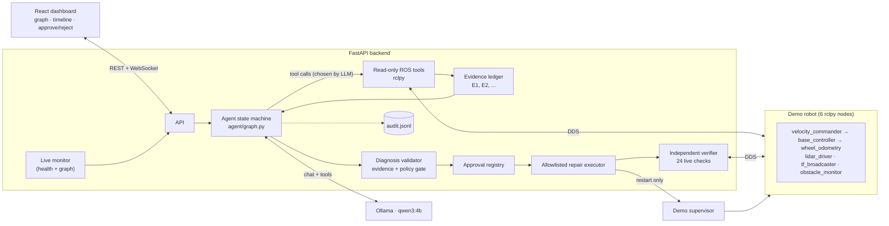
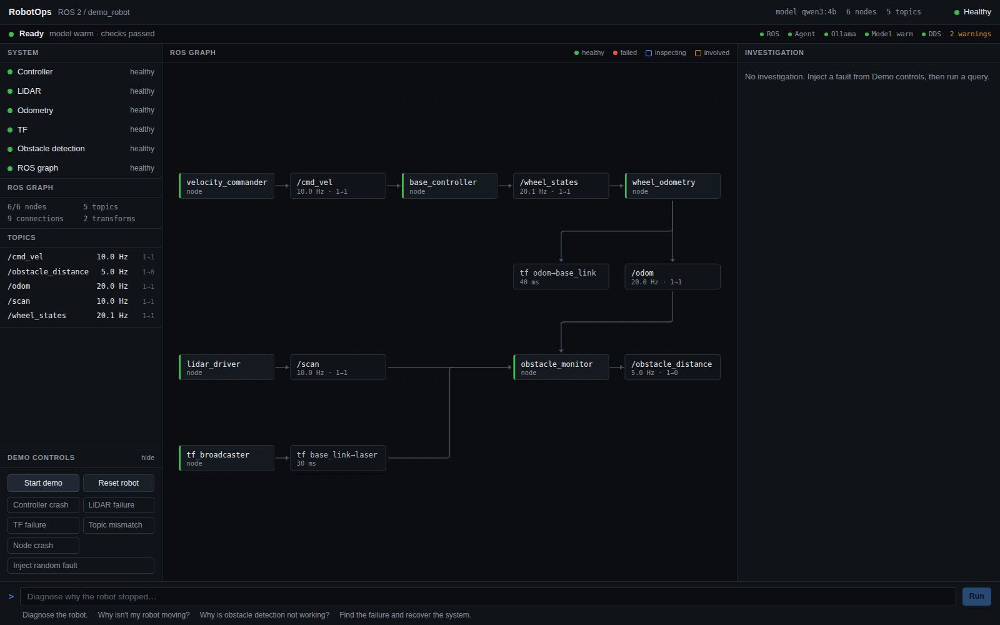
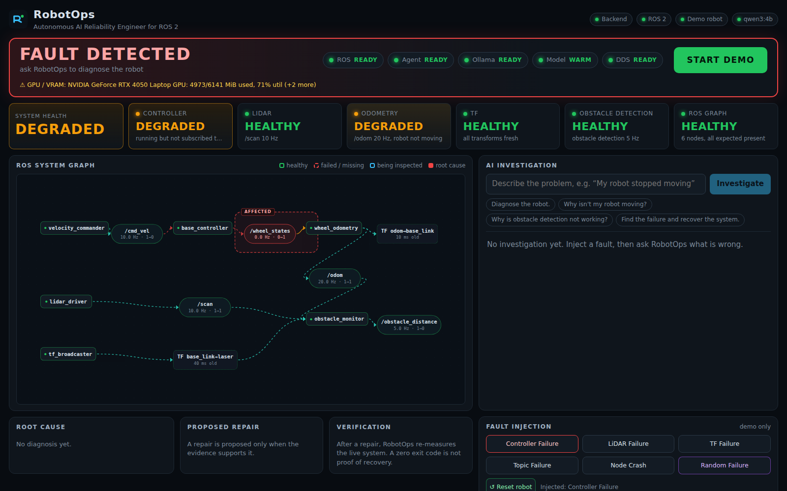

# RobotOps

Autonomous AI Reliability Engineer for ROS 2

**THE PROBLEM**

ROS robots are distributed systems. When something fails, engineers manually inspect nodes, topics, transforms, logs and controllers.

**THE SOLUTION**

RobotOps gives a ROS robot an AI reliability engineer that can investigate failures, gather evidence, propose a safe repair and verify recovery.


> *"Robot stopped moving. Diagnose it."* → a local LLM inspects the **live** ROS graph, choosing one read-only diagnostic tool at a time;
> every observation becomes numbered evidence; code (not the model) validates the diagnosis; a human approves the repair;
> the robot is restarted and RobotOps **independently re-measures** the whole system before it says "recovered".

**Measured on this repo's demo robot** (details and raw data in [docs/PERFORMANCE.md](docs/PERFORMANCE.md), `benchmarks/`):
diagnosis in 10.7 s (median, controller-crash hero path through the real dashboard, 10/10 consecutive runs; was 92 s before profiling),
recovery verified 5.4 s after approval, 15/15 random faults diagnosed correctly, repaired and verified through the UI, a 15-run
clean-state benchmark at 100 % accuracy (median 4.7 s), and no fault identity ever reaches the model (audited).

## Why it is safe

**NO EVIDENCE → NO AUTONOMOUS REPAIR.** State-changing actions require explicit human approval, only touch an allowlisted set of
demo components, and are never considered successful until the live system is re-measured. See [Safety architecture](#safety-architecture).

```
OBSERVE → HYPOTHESIZE → INVESTIGATE → COLLECT EVIDENCE → DIAGNOSE → PROPOSE → HUMAN APPROVAL → REPAIR → VERIFY
```

## Architecture



| Layer | Where | Notes |
|---|---|---|
| Demo robot | `demo_robot/` | 6 deterministic rclpy nodes (`/cmd_vel`, `/wheel_states`, `/odom`, `/scan`, `/obstacle_distance`, TF `odom→base_link→laser`, `/diagnostics`, `/rosout`) + a process supervisor with fault injection |
| Tool layer | `backend/ros_tools/` | 11 read-only tools over rclpy; structured `ToolResult`; input sanitising; timeouts |
| Agent | `backend/agent/` | explicit state machine (LangGraph is not installed; not needed), Ollama tool-calling loop, evidence ledger, diagnosis validator, verifier |
| Safety | `backend/safety/` | policy (allowlist + evidence gate), approvals (one-shot, bound to action+target), JSONL audit |
| Backend | `backend/main.py`, `backend/monitor.py` | FastAPI, WebSocket fan-out, independent health/graph monitor |
| Dashboard | `frontend/` | React + Vite + React Flow |
| Benchmark | `benchmarks/` | measured, never hand-written |

## Agent workflow

1. **Observe** – `get_ros_health` runs automatically (baseline snapshot).
2. **Investigate** – the LLM picks *one* read-only tool at a time by returning a grammar-constrained JSON decision
   (`{"reason_summary": ..., "action": "tool", "tool": "inspect_topic", "arguments": {"topic": "/cmd_vel"}}`); there is no room for
   prose, which is what made the first version take 92 s ([why](docs/PERFORMANCE.md)). It sees a compact *architecture* summary (what each node
   consumes/produces, healthy rates) - never which fault is active. The tool sequence differs by evidence (see the benchmark tables).
3. **Evidence** – each tool returns raw data *and* findings generated deterministically by code
   (`E7 [ANOMALY] Expected topic /wheel_states has no publishers`). The model only ever sees these, plus a running digest of all anomalies so far.
4. **Process rules enforced mechanically** (found by running the demo hundreds of times with a small model): the *diagnose* action is not
   selectable until the model has made 2 checks of its own, nor on the turn right after a rejected diagnosis; used parameterless tools and
   immediate repeats are removed from the schema; a hard step and turn budget applies.
5. **Diagnose** – `diagnose` decisions cite evidence IDs. The validator rejects (and explains, with the anomaly digest) if IDs don't exist,
   the cited findings come from fewer than 2 different tool calls, none is an anomaly about the target component, or the action isn't
   allowlisted. Repeated rejection → **inconclusive**, no repair.
6. **Propose → approve** – the UI shows action, target, reason, evidence, risk and expected result with
   **REJECT / APPROVE**. Nothing executes before approval; each approval is single-use and bound to that exact action + target.
7. **Repair** – allowlisted `restart_component` on the 6 demo components only. The LLM has no execution tool at all.
8. **Verify** – 24 live checks re-measure the *whole robot* (nodes, subscriptions, topic rates, TF freshness,
   diagnostics, odometry actually changing). Exit code 0 counts for nothing. Failure → one more investigation round,
   then **REPAIR FAILED** and a safe stop.

The **evidence score** is a labelled heuristic computed in code (0.30 base, +0.15 per anomaly about the faulty
component, +0.10/+0.10 for corroboration by 2/3 independent tools, capped at 0.95). The UI shows the breakdown.
Private model reasoning is never stored or displayed; the timeline shows tool calls, live values, evidence and one-line summaries only.
A model timeout shows **MODEL RESPONSE TIMEOUT - retrying** in the timeline (60 s request timeout, one retry, then a safe stop; no repair is
ever executed twice because approvals are single-use).

## Fault scenarios

| Inject | What really happens | Symptoms the agent can find |
|---|---|---|
| Controller Failure | `base_controller` logs FATAL (CAN timeout) and exits | `/cmd_vel` has 0 subscribers, `/wheel_states` gone, odometry frozen, exit code 1 |
| LiDAR Failure | `lidar_driver` stays alive but stops publishing | `/scan` 0 Hz, lidar diagnostics ERROR, obstacle detection degraded, rest healthy |
| TF Failure | `tf_broadcaster` hangs (alive, silent) | `base_link→laser` stale, `/scan` still 10 Hz, obstacle monitor reports TF errors |
| Topic Failure | `base_controller` relaunched listening on `/cmd_vel_nav` | node alive, `/cmd_vel` has 0 subscribers, `/cmd_vel_nav` has 0 publishers, parameter differs from manifest |
| Node Crash | `obstacle_monitor` exits | node missing, `/scan` lost its subscriber, `/obstacle_distance` gone |
| **Random Failure** | one of the above, chosen by the supervisor | the identity is **not** returned by the API and never reaches the agent |

## Safety architecture

- **Read-only tools run automatically; the LLM's tool list contains no state-changing tool** (tested).
- LLM arguments are validated (`^/?[A-Za-z_][A-Za-z0-9_]*(/…)*$`), clamped, and never reach a shell; there is no `shell=True`
  anywhere; rclpy is used directly.
- **Evidence gate**: repair proposals need ≥ 2 cited findings, ≥ 1 anomaly about the target (`policies.repair_gate`).
- **Approval gate**: `repair.execute` consumes an approved, unexpired proposal bound to `(action, target)`; replays and
  action swaps are refused (tested).
- **Allowlist**: one action (`restart_component`) × 6 named demo components. Anything else → `PolicyViolation`.
- **Independent verification** before an investigation can reach `RESOLVED`; the state machine forbids
  `REPAIRING → RESOLVED`.
- **Audit log** `logs/audit.jsonl`: decision, tool, args, result, approval (who/when), repair, verification.
- **Bounded**: step cap, LLM-turn cap, 3 rejected diagnoses max, 2 investigation rounds max, 120 s LLM timeout.
- **Graceful degradation**: ROS down, Ollama down, model timeout, malformed tool calls, unknown node/topic, supervisor
  unreachable — each produces a structured error, never a crash. The dashboard auto-reconnects after a backend restart.

## Screenshots

Real captures of the running dashboard (`scripts/ui_hero_demo.py --shots`), one full hero cycle:

| 1. READY FOR DEMO | 2. Fault injected (controller crash) |
|---|---|
|  |  |

| 3. Evidence-backed diagnosis, waiting for approval | 4. Approved, repaired, independently verified |
|---|---|
|  |  |

## Demo instructions

```bash
./run_demo.sh            # Ollama -> model load + warm-up -> demo robot -> dashboard -> backend -> full preflight (~40 s from cold)
./demo_preflight.sh      # re-check at any time: prints  ROBOTOPS DEMO READY  or  DEMO NOT READY + the reason (exit 0 / 1)
./verify_demo.sh --full  # PASS/FAIL: services, ROS health, tools, fault injection, full diagnose->repair->verify loop
./stop_demo.sh
```

Open **http://127.0.0.1:8000**. The banner shows **READY FOR DEMO** with ROS / Agent / Ollama / Model WARM / DDS chips only when the
model is resident and every check passed; the fault and investigate controls stay locked until then. Press **START DEMO** to reset the
robot to a healthy state and re-verify everything.

**3-minute judging sequence**

| time | do | say / show |
|---|---|---|
| 0:00 | show the READY FOR DEMO dashboard | "a real ROS 2 robot: 6 nodes, live graph; every value on screen is measured" |
| 0:20 | click **Controller Failure** | the base controller really crashes; health turns red, graph region lights up |
| 0:35 | type *Robot stopped moving. Diagnose it.* -> Investigate | the local LLM picks one diagnostic tool at a time; live values appear in the numbered timeline |
| 0:50 | (~10 s later) point at Root Cause + evidence | "every claim cites evidence IDs from real tool output; the validator, not the model, checks them" |
| 1:10 | point at Proposed Repair, risk, expected result | "nothing executes without a human" -> click **APPROVE** |
| 1:20 | watch verification (~5 s) | "it does not trust the exit code: 24 live checks re-measure the whole robot" |
| 1:30 | **INCIDENT RESOLVED** card | measured diagnosis time, tools used, total recovery |
| 1:45 | click **Random Failure**, ask *Diagnose the robot.* | "the agent is never told which fault - it discovers it from ROS evidence" |
| 2:30 | show `docs/PERFORMANCE.md` / benchmark numbers | "92 s -> ~11 s after profiling; 15/15 random faults correct" |

Backup: a recording of a real run ([docs/RECORDING.md](docs/RECORDING.md)). Useful extras: `./scripts/reset_demo.sh`,
`python scripts/diagnose_cli.py "..." [--inject controller_crash] [--auto-approve]`.

## Benchmark

`python benchmarks/run_benchmark.py [--repeat 3] [--require-quiet]` - for each fault: machine check (CPU, RAM, GPU/VRAM, Ollama, model warm, ROS
health; **warns when the machine is busy**) -> reset -> verify healthy baseline -> inject -> ask *"Diagnose the robot."* (same query, no hint) ->
score against the injected fault -> auto-approved repair (benchmark mode, logged as such) -> independent verification -> timings.
Each run writes a **new timestamped** result file; earlier results are never overwritten.

### Latest clean-state run (`benchmarks/results_20260920_052452.json`, `.md`)

Sample size: **15 runs** (15 valid), 5 fault types x 3 repeats, `qwen3:4b`, 2026-09-20 05:18:57.
**The machine was under load from an unrelated evaluation job during this run** (the runner's machine check reported it; the per-run load is in the file),
so the latency numbers are, if anything, pessimistic.

| metric | value |
|---|---|
| diagnosis accuracy | **100%** (15/15) |
| inconclusive rate | 0% |
| error rate | 0% |
| model timeout rate | 0% |
| repair executed (approved action ran) | 100% |
| recovery verified (24 independent checks) | 100% |
| median diagnosis time | 4.7 s |
| p95 / max diagnosis time (n=15, nearest-rank) | 9.1 s / 9.1 s |
| median total (diagnose + repair + verify) | 10.0 s |
| median diagnostic tool calls / model calls | 3 / 3 |

| fault | rep | diagnosed | correct | repaired | verified | diagnosis (s) | total (s) | tool calls | tools chosen by the model (after the baseline) |
|---|---|---|---|---|---|---|---|---|---|
| controller_crash | 1 | base_controller | ✅ | ✅ | ✅ | 4.5 | 9.5 | 3 | list_nodes → list_topics |
| lidar_failure | 1 | lidar_driver | ✅ | ✅ | ✅ | 8.7 | 14.1 | 4 | get_recent_diagnostics → check_tf → measure_topic_rate |
| tf_failure | 1 | tf_broadcaster | ✅ | ✅ | ✅ | 4.9 | 10.3 | 3 | get_recent_diagnostics → check_tf |
| topic_misconfig | 1 | base_controller | ✅ | ✅ | ✅ | 7.0 | 12.5 | 5 | get_recent_diagnostics → inspect_node → list_topics → list_nodes |
| node_crash | 1 | obstacle_monitor | ✅ | ✅ | ✅ | 4.5 | 9.5 | 3 | list_nodes → list_topics |
| controller_crash | 2 | base_controller | ✅ | ✅ | ✅ | 4.4 | 9.4 | 3 | list_nodes → list_topics |
| lidar_failure | 2 | lidar_driver | ✅ | ✅ | ✅ | 9.1 | 14.5 | 4 | get_recent_diagnostics → check_tf → measure_topic_rate |
| tf_failure | 2 | tf_broadcaster | ✅ | ✅ | ✅ | 4.7 | 10.1 | 3 | get_recent_diagnostics → check_tf |
| topic_misconfig | 2 | base_controller | ✅ | ✅ | ✅ | 4.6 | 10.0 | 3 | get_recent_diagnostics → inspect_node |
| node_crash | 2 | obstacle_monitor | ✅ | ✅ | ✅ | 4.7 | 9.7 | 3 | list_nodes → list_topics |
| controller_crash | 3 | base_controller | ✅ | ✅ | ✅ | 4.4 | 9.5 | 3 | list_nodes → list_topics |
| lidar_failure | 3 | lidar_driver | ✅ | ✅ | ✅ | 8.6 | 14.0 | 4 | get_recent_diagnostics → check_tf → measure_topic_rate |
| tf_failure | 3 | tf_broadcaster | ✅ | ✅ | ✅ | 4.7 | 10.1 | 3 | get_recent_diagnostics → check_tf |
| topic_misconfig | 3 | base_controller | ✅ | ✅ | ✅ | 4.3 | 9.8 | 3 | get_recent_diagnostics → inspect_node |
| node_crash | 3 | obstacle_monitor | ✅ | ✅ | ✅ | 5.0 | 10.0 | 3 | list_nodes → list_topics |

How to read this:

- The generic query *"Diagnose the robot."* leads the model to a shorter route (2-3 checks) than the hero query *"Robot stopped moving. Diagnose it."*,
  which typically adds a rate measurement and takes about 10.7 s through the dashboard ([docs/PERFORMANCE.md](docs/PERFORMANCE.md)).
- Tool sequences differ by fault (e.g. `tf_failure` stops after `check_tf`, `node_crash` uses `list_nodes -> list_topics`), but for a given fault they are
  repeatable (fixed sampling seed) - the choices are model-driven, not a fault-to-tool table, yet not broadly exploratory.
- The random-fault batch through the real UI (`benchmarks/random/`, 15 runs, real clicks, fault identity hidden and audited): 15/15 correct,
  15/15 repaired and verified, 0 inconclusive, 0 timeouts, 0 fault identifiers found in any recorded model input; median diagnosis 11.0 s.

### Earlier runs kept for transparency

| file | what it was |
|---|---|
| `benchmarks/results.md` | first version of the agent (native tool calling), 10 runs on a shared machine: 5 completed diagnoses (all correct), 3 invalid baselines, 3 model timeouts; median diagnosis 129.9 s |
| `benchmarks/results_think0.md` | first version, 1 repeat: 4/5 correct, median diagnosis 84.6 s; `topic_misconfig` failed when DDS discovery dropped under load |
| `benchmarks/results_llama.md` | `llama3.2:3b`: 5/5 inconclusive (never produced a valid diagnosis; no repair attempted) |
| `benchmarks/profiles/` | latency profiles before/after the optimisation (`baseline_*` vs `optimized_*`) |

## Tech stack

ROS 2 **lyrical** (rclpy, tf2_ros, Cyclone DDS) · Python 3.14 · FastAPI + WebSocket · Ollama (**qwen3:4b**, grammar-constrained JSON
decisions) · React 19 + Vite + React Flow (`@xyflow/react`) · pytest (+ Playwright for the UI hero/random test harnesses and screenshots).
No Docker, no database, no LangGraph - the agent is a small explicit state machine (`backend/agent/graph.py`).

## Setup

```bash
# prerequisites: ROS 2 (tested: lyrical), Node 20+, Ollama with qwen3:4b (ollama pull qwen3:4b)
uv venv --system-site-packages -p /usr/bin/python3 .venv      # must see the system rclpy
uv pip install -p .venv/bin/python fastapi 'uvicorn[standard]' httpx pydantic pytest pytest-asyncio playwright
(cd frontend && npm install)
./run_demo.sh && ./demo_preflight.sh
```

Tests: `.venv/bin/python -m pytest tests -m "not ros"` (fast, ~1 s) and `.venv/bin/python -m pytest tests -m ros`
(live-ROS tests against the demo robot, ~15 min; skipped automatically if `scripts/start_demo.sh` isn't running).
Reliability harnesses (real dashboard, real clicks): `scripts/ui_hero_demo.py`, `scripts/ui_random_demo.py`, `scripts/ui_timeout_check.py` (stalling fake model server: retry, safe stop).
See `docs/ENVIRONMENT.md` for what was detected on the dev machine, `docs/DESIGN.md` for design decisions, `docs/PERFORMANCE.md` for latency.

## Limitations

- One small LLM (`qwen3:4b`) on a 6 GB GPU. It can hallucinate a cause (it once misread "40 messages in 4.0 s" as 4 Hz); the evidence
  validator rejects such diagnoses and no wrong repair is executed, but a run can then end *inconclusive*.
  It also has habits: it opens with `get_recent_diagnostics` in nearly every run, and with a fixed seed the same fault yields the same tool
  sequence - model-driven and evidence-dependent, but not broadly exploratory. `llama3.2:3b` completed no investigation in an early benchmark.
- Several process rules (own checks before concluding, no repeated tools) are **enforced in code** because the small model would otherwise
  loop; they trade a little latency for reliability.
- The robot is a lightweight rclpy simulation of failure modes, not real hardware or Gazebo. The tool layer is generic
  (graph/topic/TF/param/diagnostics), but the robot **manifest** (`demo_robot/manifest.json`, the healthy reference) is hand-written for this demo.
- Only `restart_component` exists as a repair primitive.
- WSL2 quirk: DDS messages over ~1.4 KB need Cyclone fragmentation settings (`config/cyclonedds.xml`) and cross-process
  discovery can hiccup when the machine is heavily loaded. The GPU is shared with the Windows desktop and any other job on the laptop.
- Benchmarks are small samples (15-25 runs); treat them as evidence of reliability on this setup, not as statistics.

## Future work

Live parameter repair with allowlisted keys · lifecycle-node support · learning the healthy manifest from a baseline
recording · multi-robot fleets · rosbag capture attached to each incident · Gazebo/MuJoCo scenes · larger models.
