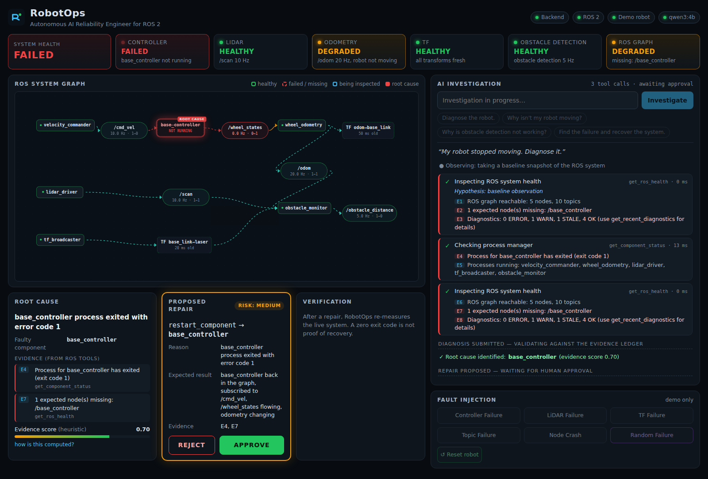
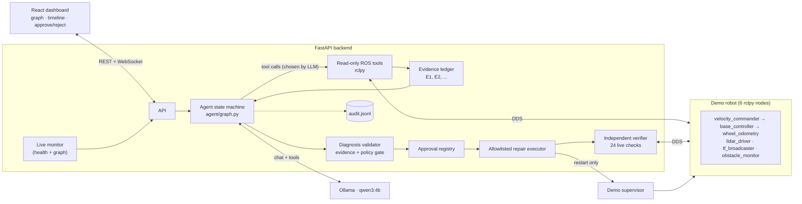
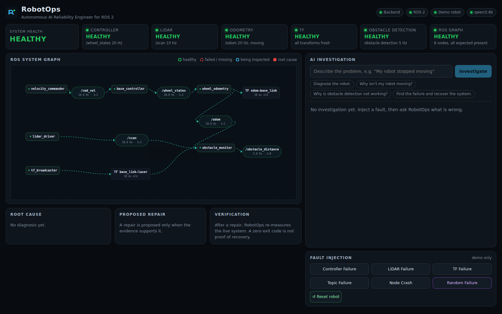
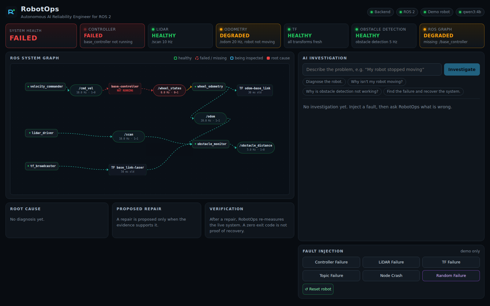
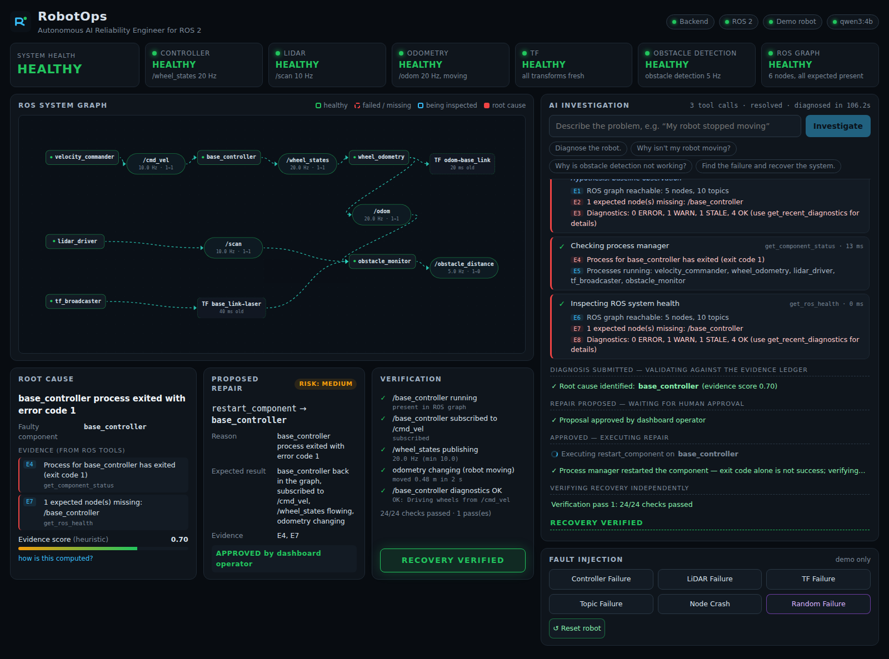

# RobotOps

**Autonomous AI Reliability Engineer for ROS 2**

> *"My robot stopped moving. Diagnose it."* → RobotOps inspects the live ROS graph, follows the evidence, finds the
> root cause, proposes a repair, waits for a human to approve it, fixes the robot, and then **independently verifies**
> that it really recovered.



## Problem

Debugging a misbehaving ROS 2 robot is slow, tribal knowledge. A single symptom ("it isn't moving") can come from a
crashed node, a silent sensor driver, a stale transform, or two nodes that disagree on a topic name — and the clues are
spread across `ros2 node list`, `ros2 topic info`, `ros2 topic hz`, TF, `/diagnostics`, `/rosout` and process managers.
Engineers run the same checks by hand, in the same order, every time.

## Solution

RobotOps is an *agent* that runs those checks for you — but chooses them the way an engineer does: by testing
hypotheses. The LLM decides which read-only diagnostic tool to call next based on what it has just observed. Every
observation goes into an **evidence ledger** with a stable ID; the diagnosis must cite those IDs, and **code** (not the
model) validates that they exist and actually implicate the component being repaired.

**NO EVIDENCE → NO AUTONOMOUS REPAIR.** State-changing actions require explicit human approval, only touch an
allowlisted set of demo components, and are never considered successful until the live system is re-measured.

```
OBSERVE → HYPOTHESIZE → INVESTIGATE → COLLECT EVIDENCE → DIAGNOSE → PROPOSE → HUMAN APPROVAL → REPAIR → VERIFY
```

## Architecture



| Layer | Where | Notes |
|---|---|---|
| Demo robot | `demo_robot/` | 6 deterministic rclpy nodes (`/cmd_vel`, `/wheel_states`, `/odom`, `/scan`, `/obstacle_distance`, TF `odom→base_link→laser`, `/diagnostics`, `/rosout`) + a process supervisor with fault injection |
| Tool layer | `backend/ros_tools/` | 11 read-only tools over rclpy; structured `ToolResult`; input sanitising; timeouts |
| Agent | `backend/agent/` | explicit state machine (LangGraph is not installed; not needed), Ollama tool-calling loop, evidence ledger, diagnosis validator, verifier |
| Safety | `backend/safety/` | policy (allowlist + evidence gate), approvals (one-shot, bound to action+target), JSONL audit |
| Backend | `backend/main.py`, `backend/monitor.py` | FastAPI, WebSocket fan-out, independent health/graph monitor |
| Dashboard | `frontend/` | React + Vite + React Flow |
| Benchmark | `benchmarks/` | measured, never hand-written |

## Agent workflow

1. **Observe** – `get_ros_health` runs automatically (baseline snapshot).
2. **Investigate** – the LLM picks *one* tool at a time (`list_nodes`, `inspect_topic`, `measure_topic_rate`,
   `check_tf`, `inspect_parameters`, `get_recent_diagnostics`, `get_recent_logs`, `get_component_status`, …). It is not a
   fixed script: the tool sequence differs per failure (see the benchmark table). Steps are capped (10 per round).
3. **Evidence** – each tool returns raw data *and* findings generated deterministically by code
   (`E7 [ANOMALY] /cmd_vel: expected subscriber /base_controller is missing`). The model only ever sees these.
4. **Diagnose** – the model calls `submit_diagnosis(root_cause, faulty_component, evidence_ids, action)`.
   The validator rejects it (and tells the model why) if IDs don't exist, fewer than 2 are cited, none is an anomaly
   about the target component, or the action isn't allowlisted. Three rejections → **inconclusive**, no repair.
5. **Propose → approve** – the UI shows action, target, reason, evidence, risk and expected result with
   **REJECT / APPROVE**. Nothing executes before approval; each approval is single-use and bound to that exact action + target.
6. **Repair** – allowlisted `restart_component` on the 6 demo components only. The LLM has no execution tool at all.
7. **Verify** – 24 live checks re-measure the *whole robot* (nodes, subscriptions, topic rates, TF freshness,
   diagnostics, odometry actually changing). Exit code 0 counts for nothing. Failure → one more investigation round,
   then **REPAIR FAILED** and a safe stop.

The **evidence score** is a labelled heuristic computed in code (0.30 base, +0.15 per anomaly about the faulty
component, +0.10/+0.10 for corroboration by 2/3 independent tools, capped at 0.95). The UI shows the breakdown.
Private model reasoning is never stored or displayed; the timeline shows tool calls, evidence and summaries only.

## Fault scenarios

| Inject | What really happens | Symptoms the agent can find |
|---|---|---|
| Controller Failure | `base_controller` logs FATAL (CAN timeout) and exits | `/cmd_vel` has 0 subscribers, `/wheel_states` gone, odometry frozen, exit code 1 |
| LiDAR Failure | `lidar_driver` stays alive but stops publishing | `/scan` 0 Hz, lidar diagnostics ERROR, obstacle detection degraded, rest healthy |
| TF Failure | `tf_broadcaster` hangs (alive, silent) | `base_link→laser` stale, `/scan` still 10 Hz, obstacle monitor reports TF errors |
| Topic Failure | `base_controller` relaunched listening on `/cmd_vel_nav` | node alive, `/cmd_vel` has 0 subscribers, `/cmd_vel_nav` has 0 publishers, parameter differs from manifest |
| Node Crash | `obstacle_monitor` exits | node missing, `/scan` lost its subscriber, `/obstacle_distance` gone |
| **Random Failure** | one of the above, chosen by the supervisor | the identity is **not** returned by the API and never reaches the agent |

## Safety architecture

- **Read-only tools run automatically; the LLM's tool list contains no state-changing tool** (tested).
- LLM arguments are validated (`^/?[A-Za-z_][A-Za-z0-9_]*(/…)*$`), clamped, and never reach a shell; there is no `shell=True`
  anywhere; rclpy is used directly.
- **Evidence gate**: repair proposals need ≥ 2 cited findings, ≥ 1 anomaly about the target (`policies.repair_gate`).
- **Approval gate**: `repair.execute` consumes an approved, unexpired proposal bound to `(action, target)`; replays and
  action swaps are refused (tested).
- **Allowlist**: one action (`restart_component`) × 6 named demo components. Anything else → `PolicyViolation`.
- **Independent verification** before an investigation can reach `RESOLVED`; the state machine forbids
  `REPAIRING → RESOLVED`.
- **Audit log** `logs/audit.jsonl`: decision, tool, args, result, approval (who/when), repair, verification.
- **Bounded**: step cap, LLM-turn cap, 3 rejected diagnoses max, 2 investigation rounds max, 120 s LLM timeout.
- **Graceful degradation**: ROS down, Ollama down, model timeout, malformed tool calls, unknown node/topic, supervisor
  unreachable — each produces a structured error, never a crash. The dashboard auto-reconnects after a backend restart.

## Screenshots

Real captures of the running system (`scripts/screenshot.py`), one full demo cycle:

| 1. Healthy baseline | 2. Fault injected (controller crash) |
|---|---|
|  |  |

| 3. Evidence-backed diagnosis, waiting for approval | 4. Approved → repaired → independently verified |
|---|---|
|  |  |

## Demo instructions

```bash
./run_demo.sh            # Ollama + demo robot + backend + dashboard  →  http://127.0.0.1:8000
./verify_demo.sh --full  # PASS/FAIL: services, ROS health, tools, fault injection, full diagnose→repair→verify loop
./stop_demo.sh
```

1. Open the dashboard: everything **HEALTHY**.
2. **Random Failure** (or a specific one) → watch a real component fail; the health bar and graph react.
3. Type **"Diagnose the robot."** (or click an example).
4. Watch the timeline: the model chooses tools, evidence IDs appear, the graph highlights what is being probed.
5. Review the **Root Cause**, **Proposed Repair** (risk, evidence, expected result) → **APPROVE**.
6. Watch the restart and the **Verification** checklist → **RECOVERY VERIFIED**, health back to **HEALTHY**.

Useful extras: `./scripts/reset_demo.sh`, `python scripts/diagnose_cli.py "..." [--inject controller_crash] [--auto-approve]`.

## Benchmark

`python benchmarks/run_benchmark.py [--faults ...] [--repeat N] [--tag name]` — for each fault: reset → verify healthy
baseline → inject → ask *"Diagnose the robot."* (same query, no hint) → score against the injected fault →
auto-approved repair (benchmark mode, logged as such) → independent verification → timings.

### Measured results (`benchmarks/results.json`, `results.md`)

Final run: **10 runs** (5 faults × 2 repeats), `qwen3:4b`, thinking off, 2026-09-19 12:12:43.
All values below are copied from the JSON the runner wrote.

| metric | value |
|---|---|
| runs / valid runs (healthy baseline reached) | 10 / 7 |
| diagnosis success (correct component, of valid runs) | 0.714 |
| repair executed (approved action ran) | 0.714 |
| recovery verified (independent checks) | 0.571 |
| median time to diagnosis | 129.9 s |
| median total time (diagnose → repair → verify) | 147.8 s |
| median diagnostic tool calls | 2 |

| fault | repeat | diagnosed | diagnosis | repair | verified | total (s) | tool calls | outcome |
|---|---|---|---|---|---|---|---|---|
| controller_crash | 1 | base_controller | ✅ | ✅ | ✅ | 135.9 | 3 | resolved |
| lidar_failure | 1 | — | ❌ | ❌ | ❌ | 151.3 | 2 | error — LLM unavailable: model timed out after 120s |
| tf_failure | 1 | tf_broadcaster | ✅ | ✅ | ✅ | 101.8 | 2 | resolved |
| topic_misconfig | 1 | base_controller | ✅ | ✅ | ✅ | 147.8 | 3 | resolved |
| node_crash | 1 | — | ❌ | ❌ | ❌ | 120.1 | 1 | error — LLM unavailable: model timed out after 120s |
| controller_crash | 2 | — | baseline not healthy (run invalid) | | | | | |
| lidar_failure | 2 | lidar_driver | ✅ | ✅ | ❌ | 193.5 | 2 | error — LLM unavailable: model timed out after 120s |
| tf_failure | 2 | — | baseline not healthy (run invalid) | | | | | |
| topic_misconfig | 2 | — | baseline not healthy (run invalid) | | | | | |
| node_crash | 2 | obstacle_monitor | ✅ | ✅ | ✅ | 156.9 | 2 | resolved |

**How to read this — it is a noisy result, not a clean 100 %:**

- Every diagnosis the agent *completed* named the correct component (5 of 5), and the tool
  sequence differed by fault (`get_component_status`, `get_recent_diagnostics`, `inspect_parameters`, `list_topics`, …).
- The misses are **infrastructure failures, not misdiagnoses**: 2 runs ended when a single model call exceeded the
  120 s timeout (`LLM unavailable: model timed out after 120s`), and 3 runs were discarded because the healthy baseline
  wasn't reached within 40 s after a reset (most nodes reported missing).
- One run (lidar, repeat 2) diagnosed correctly and executed the repair, but verification then saw *every* node as
  missing — including ones the repair never touched — so RobotOps correctly refused to call it recovered
  (re-investigated, then the model timed out). That is the safety behaviour working, on an unhealthy observer.
- **Cause of the infrastructure failures is not established.** Timeline from the audit log: model timeouts at 12:17 and
  12:24 and one unhealthy baseline at ~12:25 happened first; at 12:25:52 an unrelated CPU/RAM-heavy job (two `tinyrdt`
  evaluation processes, ~140 % CPU and ~2 GB RSS each, free RAM down to ~0.1 GB) started on the same laptop and ran
  until the end; a third model timeout (12:28) and two more unhealthy baselines (~12:29–12:30) followed. So competing load
  is a plausible contributor but cannot explain the early failures, and host load was not recorded for those runs (the
  runner now records it). A 100 s steady-state test under that load showed no graph dropouts, so the flakiness is
  tied to bursts (process restarts + model inference), not to constant load.
  Treat these rates as a smoke test on a shared machine, not as statistics. For clean numbers, close other heavy
  workloads and run `python benchmarks/run_benchmark.py --repeat 3`.
- Since this run: the baseline wait was raised to 90 s, host load / free RAM is recorded per run, and one automatic
  retry on a model timeout was added (unit-tested; **not** reflected in the numbers above).

### Earlier runs kept for transparency

| run | model | runs | diagnosis | repair executed | verified | median total |
|---|---|---|---|---|---|---|
| `results_think0.md` (1 repeat, quieter machine) | qwen3:4b | 5 | 0.8 | 1.0 | 0.8 | 89.6 s |
| `results_llama.md` (1 repeat) | llama3.2:3b | 5 | 0.0 | 0.0 | 0.0 | — |

In `results_think0`, `topic_misconfig` failed: the observer lost sight of most nodes mid-investigation (DDS discovery
under load), so the agent was reasoning over a false picture; the evidence gate still prevented a wrong repair from being
counted as success (verification failed). `llama3.2:3b` never submitted a valid diagnosis (5/5 inconclusive), so no
repair was attempted — the "no evidence → no repair" gate held with a weak model.


## Tech stack

ROS 2 **lyrical** (rclpy, tf2_ros, Cyclone DDS) · Python 3.14 · FastAPI + WebSocket · Ollama (**qwen3:4b**, native tool
calling) · React 19 + Vite + React Flow (`@xyflow/react`) · pytest (+ Playwright only for screenshots).
No Docker, no database, no LangGraph — the agent is a ~300-line explicit state machine.

## Setup

```bash
# prerequisites: ROS 2 (tested: lyrical), Node 20+, Ollama with a tool-capable model (ollama pull qwen3:4b)
uv venv --system-site-packages -p /usr/bin/python3 .venv      # must see the system rclpy
uv pip install -p .venv/bin/python fastapi 'uvicorn[standard]' httpx pydantic pytest pytest-asyncio
(cd frontend && npm install)
./run_demo.sh
```

Tests: `.venv/bin/python -m pytest tests -m "not ros"` (82 fast tests, ~1 s) and `.venv/bin/python -m pytest tests -m ros`
(19 tests against the live demo robot, ~15 min; skipped automatically if `scripts/start_demo.sh` isn't running). See `docs/ENVIRONMENT.md` for what was detected on the dev machine.

## Limitations

- One LLM (`qwen3:4b`, 4B parameters) on a 6 GB GPU: a diagnosis takes roughly 1–3 minutes, and a 4B model can pick
  inefficient tools or, rarely, fail to conclude — in which case RobotOps says *inconclusive* and does nothing.
  `llama3.2:3b` failed to complete any investigation in our benchmark.
- The robot is a lightweight rclpy simulation of failure modes, not real hardware or Gazebo. The tool layer is generic
  (graph/topic/TF/param/diagnostics), but the robot **manifest** (`demo_robot/manifest.json`, the "healthy" reference) is
  hand-written for this demo.
- Only `restart_component` exists as a repair primitive.
- WSL2 quirk: DDS messages over ~1.4 KB need Cyclone fragmentation settings (`config/cyclonedds.xml`) and cross-process
  discovery can hiccup under heavy host load.
- Benchmarks are small (a handful of runs per fault); treat them as a smoke test, not statistics.

## Future work

Live parameter repair with allowlisted keys · lifecycle-node support · learning the healthy manifest from a baseline
recording · multi-robot fleets · rosbag capture attached to each incident · Gazebo/MuJoCo scenes · larger models.
