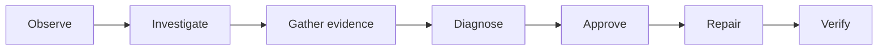
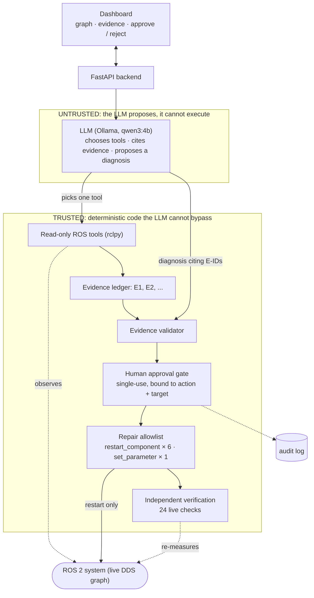
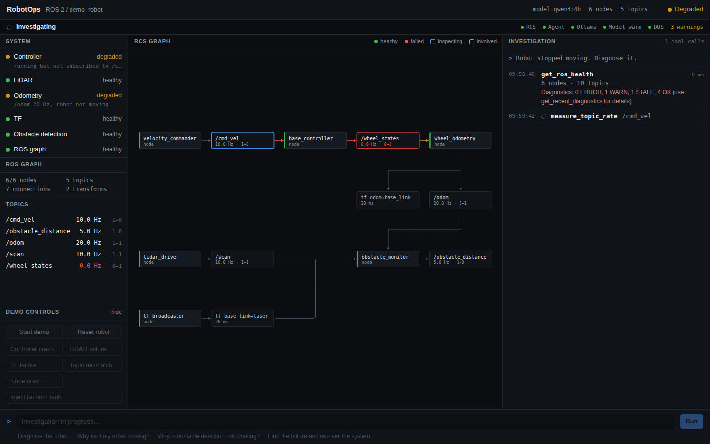
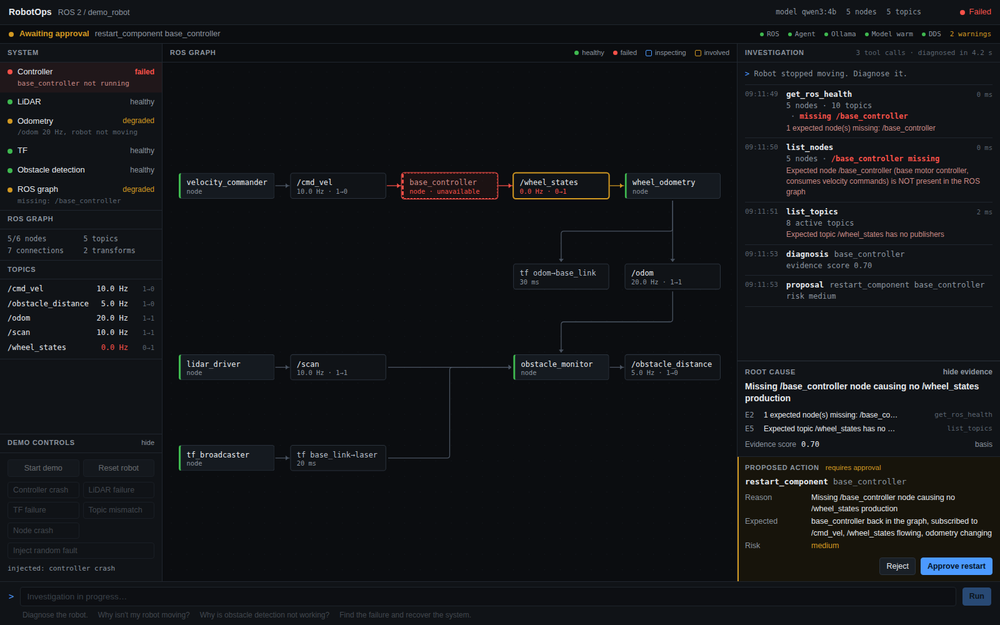
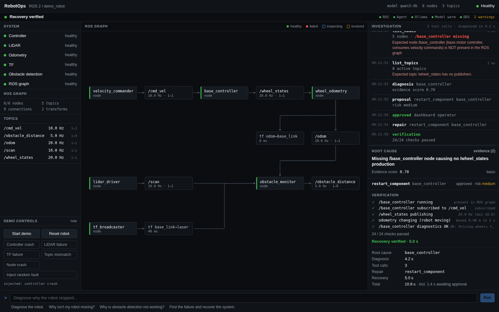

<div align="center">

# RobotOps

### Evidence-grounded AI reliability engineer for ROS 2 robots

RobotOps investigates failures in a live ROS 2 system, gathers real evidence, proposes guarded repairs, and independently verifies recovery.


[](https://github.com/Greninja44/robotops/actions/workflows/ci.yml)


*RobotOps diagnosing a controller failure from live ROS 2 evidence, requesting approval for an allowlisted repair, then independently verifying recovery.*

<sub>One uncut run (31 s), not a mock-up — [full-quality MP4](docs/media/hero-demo.mp4) · [how it was recorded](docs/RECORDING.md)</sub>


[Overview](#overview) · [Architecture](#architecture) · [Evidence-grounded agent design](#evidence-grounded-agent-design) · [Safety](#safety-model) · [Results](#results) · [Quick start](#quick-start) · [Limitations](#limitations)

</div>

> [!NOTE]
> **The LLM does not define ground truth.** RobotOps lets the model choose what to investigate, but a diagnosis may only cite evidence IDs produced
> by real ROS tool calls, and code — not the model — checks every citation before a diagnosis is accepted. State-changing actions require explicit
> human approval, only two narrowly allowlisted repairs exist, and recovery is verified independently of the model.

---

# Overview

A ROS 2 robot is a distributed system: nodes, topics, transforms, sensors and controllers, all talking over DDS.

### Problem statement

**Diagnosing a failed ROS 2 robot is slow, manual and expert-only, and a repair is only trusted once someone checks that the robot really recovered.**
When something fails, an engineer normally inspects the graph by hand — `ros2 node list`, `ros2 topic info`, `ros2 topic hz`, TF, `/diagnostics`,
logs — one command informing the next, until the symptom (*"the robot doesn't move"*) is traced back to a cause that is often several hops away (a
crashed controller node). Each step depends on what the last one showed, and the investigation is repeated for every incident.

### Solution

**RobotOps runs that investigation for you, on the live system, and keeps a human in control of the fix.** A local LLM decides which read-only ROS
check to run next; code turns every result into numbered evidence and rejects any diagnosis that is not backed by it; a person approves the one
allowlisted repair; and RobotOps re-measures the whole robot before it reports recovery. In the demo, a crashed controller is found, explained with
cited evidence, restarted and verified in about 16 s from the question to recovery (median of 10 runs).


```mermaid
flowchart LR
    A[Observe] --> B[Investigate] --> C[Gather evidence] --> D[Diagnose] --> E[Approve] --> F[Repair] --> G[Verify]
```

<details>
<summary>What each step does</summary>

1. **Observe** — a read-only health snapshot of the live ROS graph (nodes, topics, rates, TF, diagnostics).
2. **Investigate** — a local LLM chooses the next read-only ROS tool to run, one at a time, based on what it has seen so far.
3. **Gather evidence** — every tool result becomes numbered, timestamped evidence (`E1`, `E2`, ...) whose findings are generated by code from the measurement.
4. **Diagnose** — the LLM names a root cause and *cites evidence IDs*. Code validates the citations before anything else happens.
5. **Approve** — the proposal (action, target, reason, expected result, risk) is shown to a human; nothing executes without an explicit, single-use approval bound to that exact action and target.
6. **Repair** — one of two allowlisted actions (`restart_component` or, for one specific misconfiguration, `set_parameter`); the LLM has no execution tool of its own.
7. **Verify** — 24 independent live checks re-measure the *whole* robot. A zero exit code counts for nothing.

</details>

# Architecture


```mermaid
flowchart TD
    UI["Dashboard<br/>graph · evidence · approve / reject"] <--> API["FastAPI backend"]
    API --> LLM

    subgraph Untrusted["UNTRUSTED: the LLM proposes, it cannot execute"]
        LLM["LLM (Ollama, qwen3:4b)<br/>chooses tools · cites evidence · proposes a diagnosis"]
    end

    subgraph Trusted["TRUSTED: deterministic code the LLM cannot bypass"]
        Tools["Read-only ROS tools (rclpy)"] --> Ledger["Evidence ledger: E1, E2, ..."]
        Ledger --> Validator["Evidence validator"]
        Validator --> Gate["Human approval gate<br/>single-use, bound to action + target"]
        Gate --> Allow["Repair allowlist<br/>restart_component × 6 · set_parameter × 1"]
        Allow --> Verify["Independent verification<br/>24 live checks"]
    end

    LLM -->|"picks one tool"| Tools
    LLM -->|"diagnosis citing E-IDs"| Validator
    Robot(["ROS 2 system (live DDS graph)"])
    Tools -.->|observes| Robot
    Allow -->|"restart only"| Robot
    Verify -.->|re-measures| Robot
    Gate -.-> Audit[("audit log")]
```

The LLM can only choose a *read-only* tool or submit a diagnosis that cites evidence IDs — it has no execution tool, no shell, and no way to write
to the audit log. A diagnosis reaches a human only through the **evidence validator**; a repair runs only through the **approval gate** and the
**allowlist**; a run only counts as recovered through **independent verification**. Each of those is ordinary, unit-tested code that sits outside
the model. Implementation: [`backend/agent/`](backend/agent) (state machine, validator, verifier), [`backend/ros_tools/`](backend/ros_tools)
(tools, repair), [`backend/safety/`](backend/safety) (policy, approvals, audit). Design notes: [docs/DESIGN.md](docs/DESIGN.md).

# Evidence-grounded agent design

Diagnosing a distributed robot is a *sequential decision problem*: which check is worth running next depends on what the previous one revealed.
RobotOps gives that judgement to the model and keeps everything that must be true as deterministic code.

| Model decides | RobotOps enforces |
|---|---|
| What to investigate next | Tool input validation |
| Which diagnostic tool to call | Real ROS observations (rclpy, no simulated data) |
| Which hypothesis to test | Evidence-ID validation (citations must exist and support the claim) |
| The likely root cause | The human-approval gate |
| The repair to propose | The repair allowlist |
| | Independent verification of recovery |

**It is not `if fault == X: restart X`.** There is no fault-to-tool or fault-to-repair table, and the fault's identity never reaches the agent: the
supervisor keeps it for scoring only, the API withholds it for random faults, and a test plus a prompt audit (`ROBOTOPS_AUDIT_PROMPTS=1`) check that
no fault identifier appears in any recorded model input. The tool sequence really depends on the evidence: for the same query the model chose
`list_nodes → list_topics` for a controller crash, `get_recent_diagnostics → check_tf` for a TF failure, and
`get_recent_diagnostics → check_tf → measure_topic_rate` for a LiDAR failure ([benchmark table](benchmarks/results_20260920_052452.md)). Honest
caveat: with a fixed sampling seed the same fault gives the same sequence, and the small model has habits (see [Limitations](#limitations)).

# Real investigation example

Real trace of the controller-failure scenario behind the recording above (query: *"Robot stopped moving. Diagnose it."*, investigation `3c9c268e70`).
Nothing here is invented — the full machine-readable record, including all 24 verification checks, is
[`docs/examples/controller_failure_trace.json`](docs/examples/controller_failure_trace.json).

```text
09:29:43  get_ros_health
          1 expected node(s) missing: /base_controller                          [E2, anomaly]

09:29:45  list_nodes
          /base_controller missing from the ROS graph                           [E4, anomaly]

09:29:46  list_topics
          /wheel_states: expected topic has no publishers                       [E5, anomaly]

09:29:48  diagnosis                          cites E2, E5 · confidence 0.70
          base_controller — missing node causing no /wheel_states production

09:29:48  proposal
          restart_component base_controller · risk medium · awaiting approval

09:29:53  approved → repair executed (restart_component base_controller)

09:29:58  verification
          24 / 24 checks passed · recovery verified
```

<table>
<tr>
<td width="33%"><a href="docs/screenshots/states/03_investigating.png"></a><br><sub><b>Investigating.</b> One read-only tool at a time; the graph highlights what is being inspected.</sub></td>
<td width="33%"><a href="docs/screenshots/hero/03_approval.png"></a><br><sub><b>Awaiting approval.</b> Root cause cites <code>E2</code>/<code>E5</code>; nothing executes before a human clicks Approve.</sub></td>
<td width="33%"><a href="docs/screenshots/hero/04_resolved.png"></a><br><sub><b>Recovery verified.</b> 24 of 24 independent checks passed after the restart.</sub></td>
</tr>
</table>

This is the accepted diagnosis object itself (trimmed):

```json
{
  "status": "diagnosed",
  "faulty_component": "base_controller",
  "root_cause": "Missing /base_controller node causing no /wheel_states production",
  "evidence": [
    { "id": "E2", "source": "get_ros_health", "step": 1, "anomaly": true, "text": "1 expected node(s) missing: /base_controller" },
    { "id": "E5", "source": "list_topics",    "step": 3, "anomaly": true, "text": "Expected topic /wheel_states has no publishers" }
  ],
  "confidence": 0.7,
  "confidence_basis": ["base 0.30", "+0.30: 2 anomaly finding(s) about the faulty component", "+0.10: corroborated by 2 independent tools"],
  "recommended_action": { "action": "restart_component", "target": "base_controller", "risk": "medium", "requires_approval": true }
}
```

The validator rejects a diagnosis (and tells the model why) when: a cited ID does not exist; the cited findings come from fewer than two different
tool calls; none of them is an anomaly about the named component; or the action is not allowlisted. Repeated rejection ends the investigation as
**inconclusive** and no repair is proposed. `confidence` is a labelled *evidence score* computed in code from the number and diversity of cited
anomalies, not the model's own confidence. The model's private reasoning is never stored or displayed.

# Safety model

- **Read-only tools run automatically.** The LLM's tool list contains 11 read-only ROS tools and nothing that changes state (tested).
- **State-changing actions require approval.** A repair needs a proposal that passed the evidence gate and a human approval that is single-use, expires, and is bound to `(action, target)`; replay and action-swapping are refused (tested).
- **Only allowlisted repairs execute.** `restart_component` on six named demo components, plus one narrower `set_parameter` (base_controller's `cmd_vel_topic`, to its one canonical value only — no arbitrary parameter, no arbitrary value). Anything else raises `PolicyViolation`.
- **Independent verification.** The state machine cannot go from `REPAIRING` to `RESOLVED`; only 24 live re-measurements of the whole robot can. If they fail: one more investigation round, then *repair failed* and a safe stop.
- **No arbitrary shell.** Model-supplied arguments are pattern-validated and clamped; there is no `shell=True` anywhere and the model has no execution tool.
- **Audited and bounded.** `logs/audit.jsonl` records decisions, tool calls, approvals, repairs and verification. Step, turn, rejection and round caps and a 60 s model timeout (one retry, then a safe stop) bound every investigation.
- **Graceful degradation.** ROS down, Ollama down, model timeout, malformed model output, unknown node or topic, unreachable supervisor: each yields a structured error and a safe stop, not a crash.

# Fault scenarios

| Fault | Observable symptom | Repair |
|---|---|---|
| Controller crash | `base_controller` exits (FATAL log, exit code 1): `/cmd_vel` has no subscriber, `/wheel_states` disappears, odometry freezes | `restart_component base_controller` |
| LiDAR failure | `lidar_driver` stays alive but stops publishing: `/scan` at 0 Hz, LiDAR diagnostics ERROR, obstacle detection degraded | `restart_component lidar_driver` |
| TF failure | `tf_broadcaster` hangs: `base_link → laser` transform goes stale while `/scan` still runs at 10 Hz | `restart_component tf_broadcaster` |
| Topic mismatch | `base_controller` relaunched listening on `/cmd_vel_nav`: node alive, `/cmd_vel` has 0 subscribers, `/cmd_vel_nav` has 0 publishers | `set_parameter base_controller` (live fix, no restart) or `restart_component base_controller` |
| Node crash | `obstacle_monitor` exits: node missing, `/scan` lost its subscriber, `/obstacle_distance` gone | `restart_component obstacle_monitor` |
| Commander stall *(new)* | `velocity_commander` hangs: `/cmd_vel` at 0 Hz, but `base_controller` (which complains about it) is not the cause - a real multi-hop trace | `restart_component velocity_commander` |
| Odometry stall *(new)* | `wheel_odometry` hangs: `/odom` at 0 Hz and `odom → base_link` goes stale, while `base_link → laser` and the rest of the robot stay healthy | `restart_component wheel_odometry` |
| **Random failure** | one of the above, chosen by the supervisor; its identity is **hidden from the agent** and not returned by the API | whichever the evidence supports |

The repair column describes what the *correct* outcome is; the agent is never told it. Faults are injected into a real, running rclpy demo robot (6 nodes, real DDS traffic), not simulated in the UI.
*(new)* marks the two faults added after the original submission; verified directly against the live robot (real symptoms confirmed: topic rates, diagnostics, TF) but not yet part of the measured 15/15 acceptance/benchmark numbers below, which predate them.

**A second, narrower repair primitive.** `base_controller` accepts a live `cmd_vel_topic` parameter update (`ros2 param set`, no process restart) as well as a
restart — a real second option for topic mismatch, not a simulated one: exercised directly against the live node (`ros2 topic hz` on `/cmd_vel` recovers
without a process ever exiting) and through the full agent pipeline (diagnose → approve → `set_parameter` → verify, `tests/test_agent_flow.py`).
Honest result: in three ad hoc real runs of the topic-mismatch fault, `qwen3:4b` chose `restart_component` every time, even with `set_parameter` legal and
described in its prompt as the less disruptive option for a misconfigured (as opposed to crashed) component — small-model habits again (see
[Limitations](#limitations)). The mechanism is real and tested; the model does not yet reach for it on its own.

# Results

Everything below was measured on the demo robot in this repository, on one laptop (RTX 4050 6 GB, WSL2), with `qwen3:4b`. Raw data is in [`benchmarks/`](benchmarks); methodology and caveats follow the tables.

| Measurement | Result | Source |
|---|---|---|
| Hero scenario (controller crash), real dashboard, consecutive runs | **10/10** diagnosed, repaired and verified | [`benchmarks/hero/hero_acceptance_20260920_0636.json`](benchmarks/hero/hero_acceptance_20260920_0636.json) |
| Random fault (fault identity hidden), real dashboard | **15/15** diagnosed, repaired and verified on the five-fault acceptance set (all five faults occurred) | [`benchmarks/random/random_20260920_0454.json`](benchmarks/random/random_20260920_0454.json) |
| Recovery checks per successful repair | **24/24** in every one of those runs | same files |
| Model timeouts in the acceptance runs | **0** | same files |
| Hero diagnosis time (query → accepted diagnosis) | **10.6 s median** (7.5–11.3 s) | hero acceptance file |
| Hero query → recovery verified | 16.4 s median (max 17.1 s); approval → verified 5.4 s median | hero acceptance file |
| Clean-state benchmark, generic query *"Diagnose the robot."*, 5 faults × 3 | 15/15 correct, repaired, verified; diagnosis median 4.7 s, p95 9.1 s (n = 15) | [`benchmarks/results_20260920_052452.md`](benchmarks/results_20260920_052452.md) |
| Automated tests | 159 fast tests (140 behaviour, 19 documentation checks) + 19 live-ROS tests, all passing | `pytest tests` |

<details>
<summary>Per-fault detail of the 15-run benchmark (3 runs per fault, generic query, real model choices)</summary>

| Fault | Diagnosed component (3/3 correct) | Tools the model chose after the baseline | Diagnosis time |
|---|---|---|---|
| Controller crash | `base_controller` | `list_nodes → list_topics` | 4.4–4.5 s |
| LiDAR failure | `lidar_driver` | `get_recent_diagnostics → check_tf → measure_topic_rate` | 8.6–9.1 s |
| TF failure | `tf_broadcaster` | `get_recent_diagnostics → check_tf` | 4.7–4.9 s |
| Topic mismatch | `base_controller` | `get_recent_diagnostics → inspect_node` (first run also `list_topics → list_nodes`) | 4.3–7.0 s |
| Node crash | `obstacle_monitor` | `list_nodes → list_topics` | 4.5–5.0 s |

All 15 runs were repaired (auto-approved in benchmark mode) and verified 24/24. Full per-run table: [`benchmarks/results_20260920_052452.md`](benchmarks/results_20260920_052452.md).
</details>

**Methodology.** *Hero* runs drive the real dashboard with real clicks (Start demo → inject Controller Failure → ask *"Robot stopped moving. Diagnose it."* → approve) and read the outcome from the UI and API.
*Random* runs inject a hidden random fault and ask the generic query; correctness is scored against the supervisor's ground truth, which the agent never sees.
The *benchmark* runner (`benchmarks/run_benchmark.py`) resets the robot, verifies a healthy baseline, injects each fault, asks the same generic query, scores the diagnosis against the injected fault, auto-approves the repair (benchmark mode, logged) and verifies recovery.
A run counts as *correct* only if the named component matches the injected fault. Each run writes a new timestamped file; earlier files, including the failed early ones, are kept.

**How to read these numbers.**
- The sample is small (10–15 runs per measurement, one machine, one model). "15/15 on the five-fault acceptance set" is what was measured; it is evidence of reliability *on this setup*, not a claim of general accuracy.
- The 15-run benchmark ran while an unrelated CPU/GPU-heavy job was using the machine (the runner's machine check recorded it), so its latencies are if anything pessimistic. The generic query leads the model to a shorter route than the hero query, which is why its median is lower than the hero's.
- Earlier versions did worse and the files are kept: the first agent needed a median of 129.9 s per diagnosis on a shared machine, and `llama3.2:3b` completed no investigation ([`benchmarks/results.md`](benchmarks/results.md), [`benchmarks/results_llama.md`](benchmarks/results_llama.md)).
- The fault set is the five injected failure modes of this demo robot. Nothing here measures performance on real hardware or on failures outside that set.

# Performance

The first working version took a **~92 s** warm median per diagnosis. Profiling ([docs/PERFORMANCE.md](docs/PERFORMANCE.md), profiles in [`benchmarks/profiles/`](benchmarks/profiles)) showed the cause was not ROS or the GPU: the model generated about 3,000 tokens of unnecessary prose per diagnosis.
Fixes: grammar-constrained JSON decisions (no room for prose), a compact context (a manifest summary instead of raw dumps), a GPU-resident model with a blocking warm-up gate before the demo is declared ready, and a bounded per-request timeout with a retry.
Result: the hero diagnosis takes **10.6 s median** through the real dashboard (3–6 model calls of ~1–2 s each).

# UI

The dashboard is an engineering console: **System** health and topic rates on the left, the live **ROS graph** in the centre (failed, inspected and involved nodes are marked), and the **Investigation** event stream on the right, followed by the root cause with its evidence, the proposed action with **Approve / Reject**, and the verification result. The status bar always states what is happening (Ready, Fault detected, Investigating, Awaiting approval, Verifying recovery, Recovery verified) and shows ROS / Agent / Ollama / Model / DDS readiness.

# Quick start

Requirements (details and troubleshooting in [docs/SETUP.md](docs/SETUP.md)): Linux or WSL2 with **ROS 2 Lyrical** (rclpy, Cyclone DDS), Python 3.14 as used by that ROS install, Node.js 20+, and [Ollama](https://ollama.com) with the `qwen3:4b` model (`ollama pull qwen3:4b`). No API keys, no cloud service, no Docker.

```bash
git clone https://github.com/Greninja44/robotops.git
cd robotops
./scripts/setup.sh          # one-time: checks prerequisites, creates .venv, installs Python + frontend dependencies
./run_demo.sh               # starts Ollama, warms the model, starts the demo robot + backend + dashboard, runs the preflight
./demo_preflight.sh         # prints "ROBOTOPS DEMO READY"
```

Then open **http://127.0.0.1:8000**. Stop everything with `./scripts/stop_all.sh`. Something not ready? `./demo_preflight.sh` names the failing check; [docs/SETUP.md](docs/SETUP.md#troubleshooting) has the fixes.

## Reproduce the demo

1. `./run_demo.sh` (wait for `ROBOTOPS DEMO READY`)
2. Open <http://127.0.0.1:8000>
3. Press **Start demo** under *Demo controls* (resets the robot and waits until the model is warm)
4. Inject **Controller crash**
5. Enter `Robot stopped moving. Diagnose it.` and press **Run**
6. Inspect the evidence behind the root cause
7. Press **Approve restart**
8. Observe **Recovery verified** (24 / 24 checks)

Try **Inject random fault** with the query `Diagnose the robot.` to see the agent find a fault it was never told about.
The same sequence, scripted: `.venv/bin/python scripts/ui_hero_demo.py --runs 1`; to record it, `--video docs/media/hero-demo.webm` ([docs/RECORDING.md](docs/RECORDING.md)).

# Testing

The fast suite and the dashboard build also run in CI on every push and pull request ([`.github/workflows/ci.yml`](.github/workflows/ci.yml)); the live-ROS tests and benchmarks need ROS 2 and Ollama, so they run locally.

```bash
.venv/bin/python -m pytest tests -m "not ros"       # 159 fast tests (~10 s): validator, state machine, safety policy, approvals, no-fault-leak, timeouts, API, docs links
./scripts/start_demo.sh
.venv/bin/python -m pytest tests -m ros             # 19 live tests against the running ROS 2 demo robot (~4 min)
./scripts/verify_demo.sh --full                     # end-to-end: services, ROS health, tools, fault injection, full diagnose → repair → verify loop
.venv/bin/python benchmarks/run_benchmark.py --repeat 3      # the benchmark (writes a new timestamped file in benchmarks/)
.venv/bin/python scripts/ui_random_demo.py --runs 15         # random-fault batch through the real dashboard
.venv/bin/python scripts/learn_manifest.py                   # re-derive demo_robot/manifest.json from the live robot; prints a diff, --apply to write
(cd frontend && npx tsc -b && npm run lint && npm run build)
```

# Technical stack

ROS 2 **Lyrical** (`rclpy`, `tf2_ros`, Cyclone DDS) · Python 3.14 · FastAPI + WebSocket + `httpx` + `pydantic` · Ollama with **`qwen3:4b`** (grammar-constrained JSON decisions, local inference) ·
React 19 + TypeScript + Vite + React Flow (`@xyflow/react`) · `pytest` (+ Playwright for the UI harnesses). No LangGraph: the agent is a small explicit state machine ([`backend/agent/graph.py`](backend/agent/graph.py)).

## Repository structure

```text
backend/
  agent/        state machine, LLM client, prompts, evidence ledger, diagnosis validator, verifier
  ros_tools/    11 read-only rclpy tools, allowlisted repair executor, supervisor client
  safety/       policy (allowlist, evidence gate), approvals, audit log
  main.py, monitor.py, readiness.py   FastAPI app, live health/graph monitor, preflight logic
frontend/       React dashboard (src/components, src/lib)
demo_robot/     6 rclpy nodes, process supervisor with fault injection, manifest.json (healthy reference)
benchmarks/     runner + measured results (hero/, random/, profiles/) - never hand-written
tests/          fast unit/API tests and live-ROS tests (pytest marker: ros)
scripts/        setup, start/stop/verify, UI harnesses (screenshots, recordings, reliability runs), profiling, manifest learning
config/         Cyclone DDS settings for WSL2
docs/           SETUP, DESIGN, PERFORMANCE, RECORDING, SUBMISSION_AUDIT, GITHUB_SUBMISSION, screenshots/, media/, examples/
run_demo.sh, demo_preflight.sh
```

# Limitations

- **Demo topology.** The robot is a lightweight rclpy simulation of failure modes (6 nodes, real DDS), not hardware, Gazebo or Nav2. The tool layer is generic (graph, topic, TF, parameter, diagnostics, log inspection); the graph layout of the dashboard is written for this robot. The healthy-reference manifest (`demo_robot/manifest.json`) can be derived from a live observation (`scripts/learn_manifest.py`) rather than written by hand — used for real on this repo's robot, it found a real gap (a declared parameter the hand-written version had missed) — but which node broadcasts which TF edge still needs a human when more than one node publishes to `/tf` (tf2 does not expose that reliably), and prose fields (`role`, `description`) are never invented.
- **Narrow repair primitives.** `restart_component` (six components) and one `set_parameter` fix (`base_controller.cmd_vel_topic` only). Between them they fit every fault in the table above; neither fixes a hardware fault, and the model does not reliably prefer `set_parameter` over a restart even when it applies (see [Fault scenarios](#fault-scenarios)).
- **Small model.** `qwen3:4b` can misread evidence (it once read "40 messages in 4.0 s" as 4 Hz). The validator rejected that diagnosis, so no wrong repair ran, but a run can then end *inconclusive*. It also has habits (it opens with `get_recent_diagnostics` in most runs), and several process rules (own checks before concluding, no repeated tools) are enforced in code because the model otherwise loops.
- **Bounded fault set.** The measurements cover the five injected failure modes only. Behaviour on unfamiliar failures is untested; the design intent is *inconclusive, no repair*, not a guess.
- **Platform.** Developed on WSL2, where DDS needs the fragmentation settings in [`config/cyclonedds.xml`](config/cyclonedds.xml); discovery can hiccup when the machine is heavily loaded. Only ROS 2 Lyrical on Linux/WSL2 was tested. The GPU is shared with other work on the same machine.
- **Small samples.** See [Results](#results).

# Future work

Nav2 / `ros2_control` controller integration · hardware robots · an even larger fault library (lifecycle nodes, sensor drift/content-level anomalies) · fleet monitoring · more guarded repair primitives (more allowlisted parameters) · automatic TF-broadcaster attribution for the manifest learner when more than one node publishes to `/tf`.

# License

_No licence has been added yet: add one before relying on this code elsewhere (see [docs/GITHUB_SUBMISSION.md](docs/GITHUB_SUBMISSION.md))._

---

<sub>[docs/SETUP.md](docs/SETUP.md) · [docs/DESIGN.md](docs/DESIGN.md) · [docs/PERFORMANCE.md](docs/PERFORMANCE.md) · [docs/RECORDING.md](docs/RECORDING.md) · [docs/STATUS.md](docs/STATUS.md) · [docs/SUBMISSION_AUDIT.md](docs/SUBMISSION_AUDIT.md) · [docs/RELEASE_NOTES.md](docs/RELEASE_NOTES.md)</sub>
